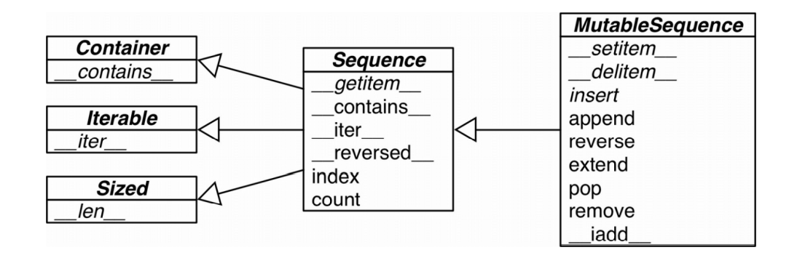
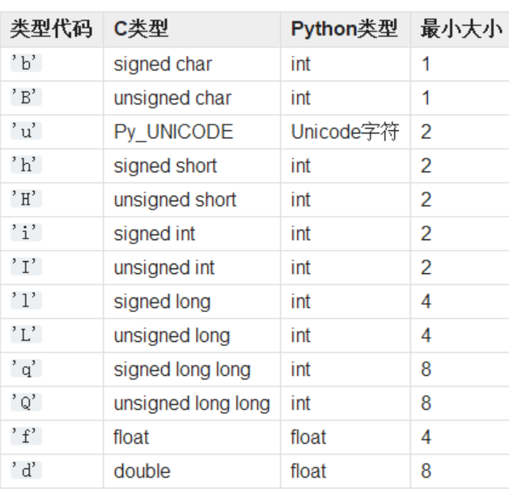

# 数据结构
## 内置序列类型
1. 容器序列：list、tuple、collections.deque能存放不同类型数据
2. 扁平序列：str、bytes、bytearray、array.array这类只能存放一种类型
   > 容器序列存放的是引用，扁平序列存放的是值
3. 可变序列：list、bytearray、array.array、 collections.deque
4. 不可变序列：tuple、str、bytes
   

<center>可变类型（MutableSequence） 和不可变类型（Sequence）的关系</center>

## 列表生成式和推导式

1. 列表生成式for循环选用的变量，如for x in，中x有自己的列表内的局部作用域
2. 生成器表达式：类似生成式，但是使用圆括号（ for x in num），只进行相应操作单不需要存储到列表中。且如果是唯一参数，可以省略括号。可以扔到一个函数中作为参数

## tuple
1. 元组拆包
   1. 可迭代对象可以拆包直接进行赋值
   2. 可以使用\*将可迭代对象拆包作为函数参数 fun（*t)
   3. _使用占位符处理不需要的元素，可以使用*来处理剩余元素如：
    ```python
    a,b,*test=range(5)
    >>>>a,b,rest
    >>>>(0,1,[2,3,4])
    ````
    4. 还可以嵌套拆包，只要对应正确。
   
    ```python
    a,b,(c,d)=(1,2,(3,4))
    ```
    5. namedtuple 创建一个类和其属性。可以使用一个可迭代对象包含属性也可以直接用字符串以空格分开
   ```python
   card=namedtuple("Card",["suit","rank"])
   card=namedtuple("Card","suit rank")
   ```
## list.sort方法和内置函数sorted
1. list.sort:
   原地修改，返回一个None
2. sorted:
   返回一个新的列表，可以对任意可迭代对象包括不可变序列和生成器
3. 关键字key：
   只有一个参数的函数会被用在序列每一个元素上，通过结果来进行排序

## 用bisect来管理已排序的序列
用二分法在有序序列中查找或插入元素
```python
from bisect import bisect,insort
a=[1,2,4,5]
bisect(a,3)
2
insort(a,3)
a
[1,2,3,4,5]
```
## 数组
1. 高效
   
   array比list更加高效，存放的不是float对象而是机器翻译。
2. 类型码
   
   指定存储数据类型，节省空间 array(类型码，初始内容)
   
   
3. 读写
   
   使用array.tofile(folder_name) 和 array.fromfile(folder_name,data_large)，使用这两个函数速度要快，分别以二进制存储.bin文件和读取

