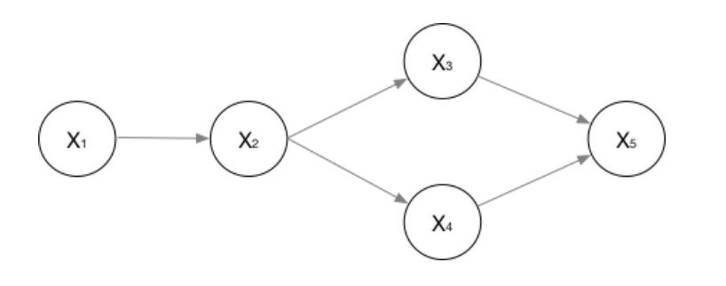

# 待定
1. 简历
   1. 简历汇报
      1. **ppt**
      2. 贯口
         1. 实习
            1. 背景
            2. 生产流程
            3. 特征分析
   2. 实习
      1. 样本不平衡
         1. 欠采样：选取一部分数据，如根据与少数类的距离选择一部分
         2. 过采样：SMOTE：对数据进行插值
         3. Focal loss：从样本难易程度进行权重分配:
            1. 增加了一个系数 $(1-p_t)^\alpha$，其中$p_t$是标签与预测概率接近的程度，越大说明分类越正确。对于分类越正确的样本，损失值越小。
      2. XLMR
         1. BPE分词
         2. 使用了TLM，对MLM进行改进，将原文和译文拼接后同时mask，一方面有利于预测mask位置，一方面能进行对齐
      3. batch size
         1. 学习率变化 线性变化，训一个epoch，用更大的batch 需要更少次iteration，同样的学习率，更小batch得到了更多的参数更新，所以作为补偿，大batch必须用更大的学习率（sigma_sum(lr * g),
         2. 优化器 LAMB ，不同层之间的参数和梯度的二范数比值(向量长度)差异很大，添加一个系数来平衡各层之间的学习率。
         3. **优化器** 
            1. RMSPROP：梯度累加的平方和的加权
      4. 多卡
      5. DPR
   3. NER 任务
      1. **CRF 原理**
   4. 毒性打分任务
      1. **Bradely-Terry 算法**，能利用的信息
      2. Albert、distillbert
   5. 框架
      1. 前向、反向代码
      2. 损失函数的计算优化
      3. 梯度检查
      4. 动态图、静态图
   6. 基础
      1. 还能做什么
         1. Query特征挖掘、同义合并
         2. 难样本
         3. 意图识别
      2. LSTM,预训练,GBDT,**还能做什么**,**GPT相关论文和并行加速**,KMP,Attention维度计算,**数据分析如何做**
   7. 提问环节
      1. 入职后负责什么内容
      2. 如果我有幸能成为公司的一员，请问我在入职前需要提前做哪些准备

# basic

## Normalization
Normlization归一化：一般用于消除量纲，在机器学习中假定各个维度服从正态分布，通过减去期望除以标准差，将其统一到参数相同的正态分布上。
归一化的优点：
1. 加快收敛速度，减少震荡(可以详细进一步讨论为什么)
2. 避免值本身，在进行距离计算时，主导了整个计算值
3. 避免数值计算问题
深度学习中的归一化主要包含两个方面：BN(Batch Normalization)和LN(Layer Normalization)。假定训练中输入矩阵维度为(N,S,H)
### BN
BN操作分为两个步骤：1.归一化 2.线性映射。其中线性映射时选择两个可以$\alpha$和$\beta$来映射。
$$y = \alpha x + \beta  $$
防止归一化对特征表达带来的破坏。即模型可以通过这两个参数映射回原来的值。当$\alpha$为标准差，$\beta$为期望时，自然变为了归一化前的值。
BN具体进行归一化操作时，对H维度上每一维进行归一化，即每一维上计算(N,S)构成的所有值的均值和方差。
**优点**：
1. 改善了ICS问题，即在参数更新情况下隐状态的分布产生了变化，而模型需要不断的去学习变化的分布。通过BN来固定隐层节点的输入。来源：Accelerating deep network training by reducing internal covariate shift 通过减少ICS来加速训练
2. 光滑了损失平面
> 扩展：当损失函数梯度小于一个常量时，满足Lipschitz连续，能使得损失函数平面光滑。加速收敛

***训练和测试阶段***
训练阶段好理解，当测试阶段时一般选用训练阶段的均值和方差，由于存在多个batch，可以取这两个参数的均值。
开源框架的具体实现：一般来说，开源框架会在训练阶段就通过滑动平均来收集这部分值，一个简单的想法时总batch为$m$个，每计算一次batch都将结果除$m$后，再求和。
>Keras:keras是使用了一个遗忘因子$t$,$E_{mov} = m*E_{old} + (1-m) * E_{new}  $ 

### LN
LN具体进行归一化操作时，对N维度上每一维进行归一化，即每一维上计算(S,H)构成的所有值的均值和方差。
NLP中一般都使用LN，因为文本的输入是不等长的，当使用BN时，(N,S)构成的矩阵中有许多空值，在batch较小情况下，均值和方差的抖动比较大。

## 分词
传统词表示无法处理未知或罕见的词(OOV)问题，而使用基于character的分词粒度太细。
### BPE
将词拆分成字符序列并添加一个后缀符号`</w>`用于表示结束。设定一个期望的subword词表大小，不断合并最高频率的连续字符，直到达到期望词表或者下一次合并结果频率为1。
> 注意，当两个待合并字符，每次都是同时出现，则只保留合并结果。其中一个与合并结果出现情况相同，则去掉该字符。如果两个都有单独出现的情况，均进行保留。

编码：编码时要注意，为了避免多种编码结果。采用的原则是从最长的token迭代到最短的token。

> wordpiece:BPE的变体，通过考虑在语言模型上的输出概率而非最大频率来进行合并。概率为句子的似然值，简言之即选择能最大程度提升信息量的合并过程。

# 基本模型
## logistic：
用线性模型取逼近真实标记的对数概率。

## CRF
### 有向图和无向图
对于有向图而言，计算联合概率用概率分解得到。
具体计算公式为
$$ 
P(x_1,x_2...x_n) = \Pi_{i = 0} P(x_i | \pi (x_i)) 
$$
其中$\pi(x_i)$，代表指向$x_i$的变量。

对于无向图而言，联合概率为图中的最大团的概率乘积。最大团就是其中存在的所有的完全图(两两之间相连)。
$$ 
P(Y) = {1 \over Z(x)} \Pi_c \psi (Y_c) 
$$

其中$\psi (Y_c)$为一个最大团的联合概率函数，$Z(x)$为归一化函数。$\psi (Y_c)$可以取以下指数形式：
$$ 
\psi (Y_c) = e ^ { - E(Y_c)}
$$

### HMM
假设：隐马尔科夫链，即每一个节点状态只和前n个状态有关，此处n取1。

