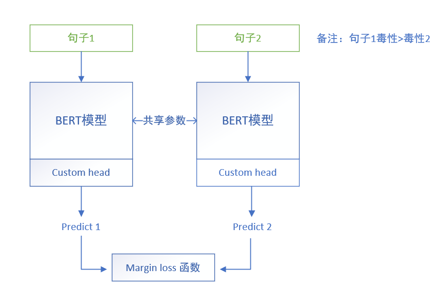
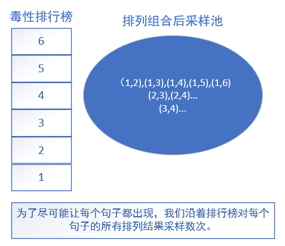
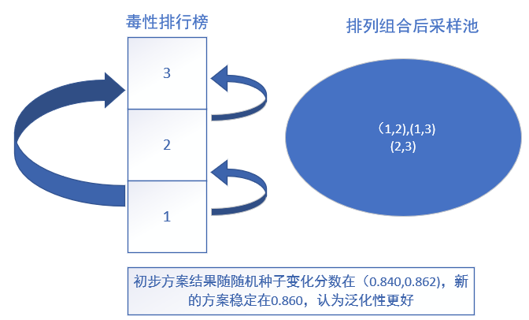
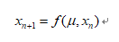
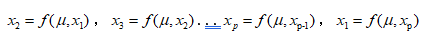
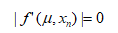
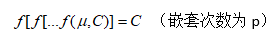

# jigsaw 有毒文本检测任务
## 任务介绍
>&emsp;当我们要求人在没有任何背景的情况对评论进行毒性标注是一件困难的事（毒性：评论让人离开聊天的可能程度）。此外，每个人可能都有自己的毒性标准。

>&emsp;一个更简单的任务是让人判断两个评论中哪一个更有毒。这种任务的标注一致性要比直接标注毒性来得高。

>&emsp;比赛提供了~30k条句子对以及标注结果，需要根据该数据集训练一个模型来对毒性进行回归分数标注。

😄 🙂 😐 😕 😞

---
# 模型选用和设计
## 训练设计
| 选用模型 | 初榜|终榜|
| ---- | ---- |----|
| LUKE | 0.86099|0.78590 |
| ALBERT | 0.81802|0.79783 |
| distill bert | 0.78491|0.79673 |
| tfidf+ridge | 0.88091|0.78605 |
|集成|0.84793|0.80342|

---

---

# 数据增强与问题

## 初步方案:
>使用模型的预测结果作为伪标签生成毒性排行榜，使用排行榜自下至上进行采样得到句子对

## 存在问题：
1. 毒性低句子进行采样时，采样范围过大，采样结果受随机种子影响
2. 毒性高句子更有可能被采样。采样过程不公平。

---
# 分级采样

1. 将句子根据毒性划分为数个等级，减小采样范围，同时排除毒性过于靠近的句子对
2. 每个句子按等级向上采样，确保公平性

---

---
