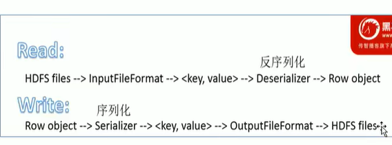
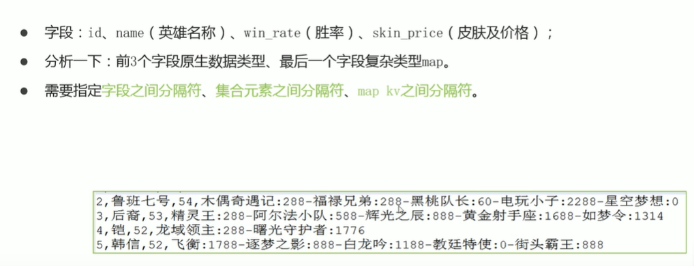

# 第一章 
数据仓库源于数据分析的要求，尤其是在mysql等关系数据库中进行数据分析读的压力更大，且各表字段不同，不统一。需要数据仓库用于面向分析、支持分析。

基本概念：
1. OLTP：联机处理系统，主要用于数据操作
2. OLAP：联机分析处理，主要用于数据分析
3. 分层：操作型数据层(ODS)、数据仓库层(DW)、数据应用层(DA)
4. ETL,ELT:ETL对数据进行抽取、转换、装载，ELT顺序不同
   
# Hive 
能将结构化、半结构化数据文件映射为一张数据库表。Hive 利用HDFS存储数据，利用MapReduce查询分析数据，Hive帮助用户将HQL转换为MapReduce程序，背靠Hadoop进行分布式处理。
分布式存储文件系统HDFS
元数据：
1. 元数据metadata：用来描述数据的数据,存储在关系型数据库当中
2. 元数据服务metastore：用于管理metadata元数据，对外提供地址，各种客户端通过访问地址，使用metastore服务获取元数据
3. metastore配置方式：内嵌模式、本地模式、远程模式
   1. 内嵌模式：元数据存储在内置Derby数据库，启动HiveServer进程时，同时启动元数据服务，只能提供一个用户，主要用于测试
   2. 本地模式：存储元数据的数据库在单独的进程中运行，每启动一个hive服务，都内置启动了一个MetaStore
   3. 远程模式：MetaStore在单独的JVM运行，


安装：
1. 服务器基础环境
2. Hadoop集群健康可用，需要先启动Hadoop集群，先等待HDFS安全模型关闭再启动运行Hive
3. 修改配置

流程：
1. 用户编写sql
2. sql语法解析、语法编译
3. 将以元数据形式存储的映射信息读取
4. 根据sql生成执行计划，并优化
5. 生成mr程序
6. 返回结果

数据模型：如何管理、组织、操作数据
1. Table 表
2. Partition 分区，分区时hive的一种优化手段，指定表的某一列作为分区列，根据其值能划分为不同的分区。分区在存储上在table表目录下以子文件形式存在。
3. bucket 分桶，根据指定列值进行分桶，用指定列进行mod运算，余值相同分到同一个桶中。

# 数据定义语言DDL
数据定义语言是sql语言集中对数据库内部的对象结构进行创建、删除、修改等的操作语言。核心语法由CREATE、ALTER、DROP组成，并不涉及表内部数据的操作。

建表的完整语法树
```sql
CREATE[temporary][external]TABLE[if not exists][db_name.]table_name
[(col_name data_type[comment col_comment],...)]
[COMMENT table_comment]
[PARTITIONED BY (col_name col_type[comment col_comment],...)]
[CLUSTERED BY (col_name col_type,...)[SORTED BY (col_name[ASC|DESC],...)]INTO num_buckets BUCKETS]
[ROW FORMAT DELIMITED|SERDE serde_name with serdeproperties (property_name=property_value,...)]
[STORED AS file_foramt]
[LOCATION hdfs_path] /*指定创建表所需的数据存储路径*/
[TBLPROERTIES(property_name=property_value,...)];
```
**注意** 需要保持关键字的顺序

数据类型
1. 原生数据类型：数值、时间、字符串、杂项
2. 复杂数据类型：数组、映射、结构、union
3. HIVE会帮助进行隐式转换，从窄类型到宽类型转换才能成功

## Serde：
用于序列化和反序列化，Serde读取和写入表行对象，包含三个内容：InputFormat、OutputFormat、Serde类
读取：调用InputFormat来进行读取，生成key-value键值对，再调用SERDE来进行分割，反序列化得到对象
写：对行对象进行序列化，得到key-value键值对，再调用OutputFileFormat，得到HDFS files


### Row FORMAT行
```sql
[row format delimited|serde serde_name with serdeproperties (property_name=property_value,...)]

```
ROW FORMAT是关键字，DELIMITED和SERDE二选一，选择DELIMITED时，默认选用LazySimpleSerDe类来处理数据，不使用ROW FORMAT时，默认使用'\001'作为分隔符
LazySimpleSerDe分隔符指定：
```sql
ROW FORMAT DELIMITED
    [FIELDS TERMINATED BY char] /*指定字段之间分隔符 */
    [COLLECTION ITEMS TERMINATED BY char] /* 指定集合元素之间分隔符*/
    [MAP KEYS TERMINATED BY char] /* Map映射kv之间分隔符*/
    [LINES TERMINATED BY char] /* 行数据之间分隔符*/
```

练习1

```sql
use itheima;
CREATE TABLE hero(id int COMMENT "ID", name string COMMENT "名称" ,win_rate int COMMENT "胜率",skin_price map<string:int> COMMENT "皮肤价格")
ROW FORMAT DELIMITED 
    FIELDS TERMINATED BY '\t'
    COLLECTION ITEMS TERMINATED BY "-"
    MAP KEYS TERMINATED BY ":"
```

## 内、外部表
[external]字段指定是否为外部表
内部表：被Hive拥有和管理的托管表，当删除时，自动删除数据和元数据。
外部表：删除外部表只会删除元数据

## 分区表
```sql
CREATE[temporary][external]TABLE[if not exists][db_name.]table_name
[(col_name data_type[comment col_comment],...)] /* 分区字段是虚拟值，在创建后也并不存在底层文件中*/
[PARTITIONED BY (col_name col_type[comment col_comment],...)] /* 注意分区指定列不能在创建中重复*/
```

### 静态分区
分区的属性值由用户在加载数据的时候手动指定，
```sql
load data [local] inpath 'filepath' into table tablename partition(分区字段 = '分区值'...);
/*
local 参数指定加载数据位于本地文件系统还是HDFS文件系统
由create创建分区，再由加载语句将文件加载到相应文件夹中。partition(分区字段 = '分区值'...)，用于指定文件夹
*/
```
不同分区对应不同文件夹，同一分区数据存储在同一文件夹下，查询时避免全表扫描。

### 动态分区
动态分区：分区的字段值基于查询结构自动推断
设置两个参数
```sql
/*是否启动动态分区*/
set hive.exec.dynamic.partition = true;
/*是否关闭严格模式，严格模式要求至少一个静态分区*/
set hive.exec.dynamic.partition.mode = nonstrict;
```
通过insert 和select进行动态指定
```sql
insert into table table_name1 partition(col_name1)
select tmp.* tmp.col_name2 from table_name2
/* 由table2来动态指定，其中tmp.*对应到创建表时的列中，tmp.col_name2对应到col_name1中去/
```

## 分桶
用于优化查询而设计，桶编号相同的数据会被分到同一个桶中，置于同一个文件内。
优点：
1. 加快查询速度，例如查询分桶字段state时，例如where state ='new york',通过计算相应哈希值就能找到相应文件再进行查询，类似于分区表
2. Join时，能减少笛卡尔积数量。当分桶字段和join的on字段相同时，笛卡尔积从全表变成单个文件
3. 方便高效抽样
```sql
Bucket number = hash_function(bucketing_column) mod num_buckets
/* hash_function取决于bucketing_column类型，如果是int类型还好，其他类型如bigint，string将会是该类型派生的某个数字，比如hashcode值。
```
创建分桶
```sql
CREATE[temporary][external]TABLE[if not exists][db_name.]table_name
[(col_name data_type[comment col_comment],...)]
[CLUSTERED BY (col_name col_type,...)[SORTED BY (col_name[ASC|DESC],...)]INTO num_buckets BUCKETS]
/*分桶与分区不同，分桶必须指定表中存在的列名， */
```
插入方式：类似动态分区，需要通过insert+select语法进行，首先要创建一张普通的表。再通过insert select语法进行
```sql
insert into table new_bucket_table
select * from exist_table
/* 由table2来动态指定，其中tmp.*对应到创建表时的列中，tmp.col_name2对应到col_name1中去/
```

# 事务表
Hive sql在设计之初并不支持对表内数据进行删改（即update和delete），后续支持后仍然有较多要求
要求：
update 实现是通过先删除后插入方式实现
` update table_name set column_1=value1 ... where ... ;`
1. 设置
```
set hive.support.concurrency = true;
set hive.enforce.bucketing = true;
set hive.exec.dynamic.partition.mode = nonstrict;
set hive.txn.manager = org.apache.hadoop.hive.ql.lockmgr.DbTxnManager;
set hive.compactor.initiator.on = true; --是否在MetaStore实例上运行启动线程和清理线程
set hive.compactor.worker.threads = 1; --在MetaStore实例上运行多少个压缩程序工作线程
```
2. 必须为分桶表
3. 必须作为 orc格式，即创建语法中的stored as orc
4. 必须设置属性中事务功能开启，即语法中TBLPROPERTIES('transactional'='true')
5. 不能是外部表
   
## 视图
视图是一个虚拟表，可以从表或者视图中创建，不能进行插入操作。
```sql
create view as select column_name from exist_table_or_view
```
1. 对特定数据提供给用户，保护敏感数据
2. 优化查询语句撰写，但是不能提高效率

### 物化视图
预先计算操作结果，来提高效率
待补充

## 其他操作
库的DDL操作
1. 创建create database database_name
2. describe database 显示数据库信息，extended关键字用于显示更多信息
3. use database 切换数据库
4. drop database 不能删除非空数据库，添加关键字cascade drop database database_name cascade
5. alter database database_name set [dbproperties(property_name=property_value)|owner user username|location hdfs_path] 更改库的属性、所有者、路径
   
表的DDL操作
1. describe table 显示表信息，extended序列化形式显示，formatted表格形式显示
2. drop tabele 删除数据，包括元数据和数据，对于外部表而言只删除元数据
3. truncate table 清空表，保留元数据
4. alter table table_name 修改属性、列名、顺序等等，一般不常用，因为可以直接删了重新映射

分区的DDL操作
1. 增加分区
   1. alter table table_name add partition(col_name='a' )location ' ' 
   2. add操作会更改表元数据但不会加载数据，要保证增加分区路径下数据已经存在或者之后导入分区数据。可以认为文件夹有了相应数据还没有，创建名为col_name的值a的文件夹
2. rename 
3. msck partition，表示元数据检查操作，用于元数据的修复。即纠正直接在HDFS上操作但是未同步到元数据的情况进行检查修复。` MSCK [REPAIR] TABLE table_name[ADD/DROP/SYNC PARTITIONS];`

show操作
1. show tables;
2. show schema;
3. show views
4. show partitions table_name
5. show create table table_name 显示创建语法
6. show columns (from|in) table_name [(from|in) db_name] 显示列

# 数据操控、查询语言(DML,DQL)

## Load 加载数据
`LOAD DATA [LOCAL] INPATH 'filepath' [overwrite] into table tablename [partition (partcol=val1,partcol2=val2)]`
1. local 指定代表本地文件路径，默认未相对路径。否则根据完整路径查找。本地指Hiveserver2服务所在机器的本地linux文件系统。一般未指定Schema会从默认开始即HDFS文件系统中
2. overwrite 对目标表或者分区进行覆盖重写
3. 当从本地加载时，相当于进行了复制操作，但是如果从HDFS开始相当于进行了移动。

## insert 使用

1. `insert into table table_name values(column_value1,column_value2,...)`直接使用insert value效率极低
2. 将查询结果插入表中`insert into|overwrite table table_name1 [PARTITION(partcol = val1,partcol2=val2...)] select column1 column2 ... from from_table_name;` 将查询结果插入表中,要求查询和插入列能对应
3. 多重插入`from from_table_name insert into|overwrite table table_name1 select column1 ...  insert into|overwrite table table_name2 select column2 ... ` 多重插入，扫描一次插入多个表减少扫描次数
4. 数据导出 `insert overwrite [local] directory directory1 [rowformat rowformat1] [stored as file_format] select column1 ... from table_name1 导出是一个覆盖操作，谨慎\
   
## select 
```sql
[with common tableexpression(,CommontablExpression)*]/* 通过with进行一次简单查询，得到一个临时的结果，仅在本次查询中有效 with temp_table as  (select ...) */
SELECT [ALL|DISTINCT] select_expr,select_expr,...
FROM table_reference
[WHERE where_condition] /*不允许聚合函数，需要的话可以用having操作，where在分组前过滤，而having是之后，而聚合函数要求整个结果上进行 */
[GROUP BY col_list] /*启用group by时要么select groupby字段，要么是聚合函数结果 */
[ORDER BY col_list]/*仅有一个reduce进行排序，损耗大 */
[CLUSTER BY col_list 
|[DISTRIBUTE BY col_list][SORT BY col_list]
] /*cluster by 相当于放到同一个reduce中再进行排序，且要求为同一列,分reduce方法和分桶规则相同。*/、
/*cluster by 只能指定一个列，会将哈希相同放同一列并按该列排序，如果需要根据某列分桶再根据其他列排序，需要改为DISTRIBUTE BY col_list1 SORT BY col_list2 的组合  */
[LIMIT [offset,]rows];
```
执行顺序：from->where->group(含聚合)->having->order->select

### union：
对多个查询进行合并，`select ** from ** union [all|distinct] select ** from **` union 默认进行distinct
如果要对单个select进行order by、sort by、limit等操作时，需要先作一个子查询，再通过select返回如：`select column1,column2 from (select column1,column2 limit 5) table_name2 union ...`
如果要对整个union进行，则在最后执行即可

子查询：
1. from 中的子查询 (...) 别名
2. where中的子查询
   1. 不相关子查询：不使用外部列 `where outter_table_name.column1 IN (...)`
   2. 相关子查询：使用外部列 `where outter_table_name.column1 EXISTS  (select .. where outter_table_name.column2=inner_table_name.column3)`
   
join
1. 内连接 inner join，` a inner join b on a.c=b.c`
2. 左连接(左外连接)，以左表为准，能连接上的返回右表数据，不能的返回null ` a left join b on a.c=b.c`
3. 右连接(右外连接)
4. full outer join (全外连接)，等价于分别进行左外连接和右外连接，再进行一次去重。能匹配就返回左右表数据，不能就带上null一起返回
5. left semi join (左半开连接)，相当于inner join但是只返回左表
6. cross join (笛卡尔集)，没有条件的inner join，返回所有组合
注意事项
1. 支持复杂表达式，包括非等值条件
2. 同一查询支持连接两个以上的表
3. 最后一个表会通过reduce流式传输，并在其中缓冲其他表，因此大表放在最后有助于减少内存
4. join在where之前进行
   
# Hive 运算符、函数

## 关系运算符
1. `is [not] null` 是否为空
2. `like `做类似正则的匹配'_'表示单个字符 '%'表示任意多个字符
3. jave的rlike操作`rlike` 正则匹配，功能与regexp相同
   
## 算数运算符
1. 取整 div
2. 取余 %
3. 位与操作 &
4. 位或操作 |
5. 位异或操作 ^ ，异或表示两者值不同则结果为
   
逻辑运算符：and、or、not、！、in、not in、exists(相关子查询)

## 函数
### 字符串函数
1. 连接 concat(str1,str2)
2. 带分隔符连接 concat_ws(split_char,str1,str2)
3. 正则替换函数 select regexp_replace(str1,reg_exp)
4. 正则解析提取 select regexp_extract(str1,reg_exp,location_index)
5. URL解析函数 parse_url
6. json提取函数

### 条件函数
1. if(boolean testCondition,T valueTrue, TvalueFalseOrNull) 相当于？运算发
2. nvl( value,  default value)如果为空置，转换为默认值
3. COALSESCE( v1, v2,...)返回第一个非空值
4. CASE a WHEN b Then c [When d Then e]* [ELSE f] END WHEN相当于if a==b ，后续可以接多个When 表示elif
5. assert_true(condition) 若不为真，触发异常
   
类型转换函数 cast(value as data_type)
数字脱敏函数 mask(str)分别对大写字母、小写字母、数字进行替换，还可以自定义替换规则

### 用户自定义函数
UDF函数：输入一行输出一行
UDAF函数：输入多行输出一行
UDTF函数(表生成函数):输入一行输出多行

练习：实现手机号加密
要求：1.判断非空、手机号位数判断，2.校验手机号格式，3.对不符合要求的数据直接返回，不处理

### explode函数：把array、map等拆开成多行
select explode('array'(11,22,33,44,55))
select explode('map'("id1":11,"id2":22,"id3":33,"id4":44,"id5":55)) 拆出两列key一列，value一列
问题：explode返回一张虚拟表，但是如果需要源表内容就会出现错误。例如表包含name、year。select b.name,explode(b.year) from b 
解决：可以通过join关联查询解决，但是同样Hive提供了一种lateral view方法用于该问题
lateral view 侧视图：将UDTF结果与原表每一行进行了join：select a.name explode(b.column_name1) from tablename1 a lateral view b as column_name1

### 聚合增强函数
1. grouping sets 将多个group by逻辑写在一个sql语句中，相当于多次单独的group by再通过union聚合。语法为group by column1，column2，grouping sets(column1,column2)，sets中也可以再用(column1,column2)的组合。grouping_id用于表示哪个分组
2. cube 表示根据GROUP BY维度的所有组合进行聚合，with cube，表示将group by中的所有列的所有组合后进行union，包括空
3. rollup，cube的子集，以左侧维度为主，如group by a,b 包括(a),(a,b),(a,b,c),()

### 窗口函数
与聚合函数类似，但是返回多行，每一行都输出聚合结果，相当于原表和结果进行了join
语法：`select column1,column2,agg_function(column3) over(partition by column2 [order by column1] [window_expression]) as another_name1 from table_name1;` 
order by 用于累积运算,默认为第一行到当前行，可以通过window_expression控制聚合累计运算范围
窗口排序函数：rank() over (),dense_rank(),row_number(),其中rank、dense_rank考虑重复，其中dense_rank重复仍然计数，例如两个都标为3，下一次计数从5开始
窗口分析函数:

## 抽样函数
1. 随机采样
通过DISTRIBUTE BY rand() SORT BY rand() Limit num;来实现随机抽样
select * from table1 TABLESAMPLE(NUM PERCENT)基于数据块抽样，百分比抽样缺点是随机性不好
2. 存储桶表采样
TABLESAMPLE(bucket x out of y [on colname])
y 必须是table总bucket数的倍数或者因子，通过桶数/y缺点抽多少数据，x表示从哪个bucket开始。on表示基于什么抽 on rand() 随机抽， on 分桶字段，基于分桶字段抽效率更高

## 重要函数

### 多字节分隔符处理
LazySimpleSerDe只支持单字节分隔符
问题：1.分隔符中包含多字节 2.内容中包含分隔符
解决问题：1.暴力替换分隔符 2.RegEx用正则匹配来加载数据 3.InputFormat
### URL解析函数
URL格式：协议类型：//域名/访问路径？参数数据
parse_url:parse_url(url,part_name1):解析完返回相应的content内容，一次只能返回一种
parse_url_tuple:parse_url_tuple(url,part_name1,part_name2,part_name3):udtf函数，需要配合侧视图Lateral view配合使用

### json数据处理
1. json函数处理
   1. `get_json_object(json_str,"$.colname")` 返回一列值
   2. json_tuple(json_str,j1,j2...) 返回多个值
2. json Serde

### 拉链表的设计与实现
Hive需要定期从外部数据源中同步数据
1. 直接更新：简单，但是没有历史状态
2. 每次保存一张全新表：存储冗余
3. 拉链表：通过时间标记发生数据变化的状态的周期(开始和结束时间)
   1. 先产生增量表
   2. 合并增量表和原表，更改原表中更新值的结束时间到临时表中
   3. 临时表覆写原表

## 优化
文件格式
1. TextFile:默认文件格式，存储形式为按行存储。读取列性能差
2. SequenceFile:以二进制kv形式存储
3. PARQUET:压缩编码效率更高
4. Orc：来自Hive的列式存储格式

数据压缩：
Hive压缩实质上就是MapReduce压缩
压缩能减少存储空间，提高传输效率，但是增加了cpu负担和压缩解压时间

存储优化：
Hive不适合小文件，每条小文件会产生一条元数据信息
1. hive生成小文件，能自动合并小文件，需设置
2. hive能在处理过程中合并小文件，需设置

orc优点
1. 索引
   1. row group index：根据最大最小值进行跳过
   2. Bloom Filter Index：当查询条件中包含对该字段的等值过滤时，先从BloomFilter判断
   3. 矢量化查询，针对orc一次性读取多行进行处理
   
mr优化：
1. 可以自动设置切换本地模式，当数据量小时在本地处理，避免调用yarm集群，耗时过长
2. jvm重用，Hive会为每一个Task启动一个Jvm，重用允许Jvm运行多个任务再销毁
3. 并行执行：多个stage没有依赖时可以并行进行

join优化：
1. map join ：适合小表join大表
2. reduce join：适合大表join大表

谓词下推：将过滤条件提前执行，减少map到reduce的传输时间
数据倾斜：数据分配不合理，大部分task结束，剩余少数一直在运行

# Hadoop

核心组件
1. HDFS 分布式文件存储系统
2. YARN 集群资源管理和任务调度框架
3. MapReduce 分布式计算框架
   
Hadoop集群包括两个集群：HDFS集群、YARN集群

## HDFS
1. 主从架构
2. 分块存储
3. 副本机制
4. 元数据记录
5. 抽象统一的目录树结果
   
角色和职责：
1. NameNode：分布式系统核心，维护和管理文件系统元数据，要求大量内存
2. Datanode：负责具体的数据块存储
3. secondarynamenode：充当namenode的辅助节点，帮助著角色进行元数据文件的合并
上传文件流程：
基本概念
1. pipeline管道，建立datanode之间管道，进行副本的数据传递。
2. ack应答响应：进行ack确认，保障传输正确性
3. 默认3副本存储策略：三个副本放在三台不同机器上
流程：
1. 创建对象实例DistributedFileSystem
2. 调用相应create方法，通过rpc请求NameNode创建文件，NameNode进行权限检查
3. 返回FSDataOutputStream输出流
4. 客户端通过输出流开始写数据
5. 内部组件DataStreamer请求NameNode进行分配物理存储地址
6. ack检查
7. close关闭
8. 等待NameNode确认

## MapReduce
**先分再合，分而治之**
map：将复杂任务分解为若干个简单子任务，reduce：合并，对map阶段结果进行全局汇总。应用于大数据计算，并且计算任务可拆分以及数据之间没有依赖关系
处理数据类型均为k，v的键值对


三类进程：1. MRAppMaster：负责整个MR程序的过长协调及状态协调 2. MapTask：负责map阶段的整个数据处理流程 3.ReduceTask 负责reduce阶段的整个数据处理流程
要求：一个map一个reduce作为过程，可以没有reduce直接结束
### 流程介绍：
依托wordcount介绍
1. map 过程
   1. 逻辑切片
   2. 按规则返回k，v对
   3. 调用map方法处理数据
   4. 分区
   5. map结果放入内存缓冲区
   6. 缓存区到达一定比例，对所有溢出文件进行merge合并
2. reduce 过程
   1. 主动从maptask复制拉去数据
   2. 进行合并merge，并排序
   3. 调用reduce方法，键相等的键值调用一次reduce方法，写入HDFS文件中
3. shuffle 过程：将map端的无规则输出按指定规则，形成具有一定规则的数据，以便reduce端接收处理。map和reduce中map任务和reduce任务中间过程都属于shuffle

## yarn
通过资源管理系统和调度平台
组件：
1. ResourceManager：负责资源分配的最终权限
2. NodeManager：负责本机器上的计算资源
3. ApplicationMaster：负责程序内部各阶段的资源申请，监督程序的执行情况
   