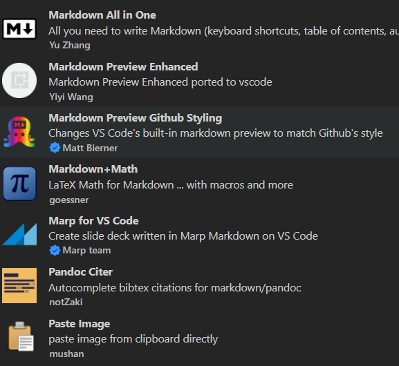
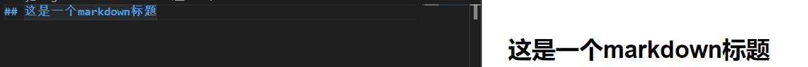

# 如何使用markdown撰写论文
&emsp;&emsp; markdown是一种新的标记型语言，能做到易读易写的方式编写文档。我不是一个精通word的人，按钮一多我就头晕，格式控制只会空格和换行，当需要对前面写的内容进行修改时，格式控制的错误使用会导致整个内容乱成一团。
&emsp;&emsp; markdown通过语法控制基本的格式，更加复杂的内容留给渲染完成，你只需要专注写写写就好。对我而言markdown优点主要如下，如果你也有相应烦恼可以试着学一下：
1. 写公式方便：word自带的手动公式编辑器体验很差，图片识别如mathpix等自定义性不好。markdown支持latex公式，还不用学复杂的latex语法，体验流畅。
2. 文献引用、图片引用：用word写论文，修改过程如果要插入其他文献或者图片，所有文献引用、图片引用编号都要手动改。markdown通过几个小插件就能统一管理好引用和自动编号等问题。
3. 论文格式：能非常方便转换为word或其他文件形式，配合标准的csl文件渲染，能得到一份非常不错的初稿。能提供特定csl文件情况下，能很方便自动化转为所需格式。
4. 专注：纯文本方式能减少其余操作（比如反复动鼠标），更好集中在内容上。

&emsp;&emsp;考虑到可能有人和我一样是懒狗+三分钟注意力，这篇教程会集中在主要脉络上，剩余的一些细节东西会以链接形式提供，可以在实践过程具体去看。本文主要分以下三部分
1. 前期准备
2. 如何使用markdown
3. 公式编辑和图片插入
4. pandoc和相应图片引用、文献引用、输出样式

# 前期准备
&emsp;&emsp;不需要编程知识，但是需要用到几个简单的命令，复制粘贴即可。需要装python环境和vscode，其中python环境是需要用到装几个python工具包，不需要编程。
## vscode和python
&emsp;&emsp;vscode是微软推出的一个轻量化的编辑器。关于markdown编辑器有很多选择，但是vscode支持海量插件，有一些能帮助我们更好写文档。
&emsp;&emsp;软件和python安装还有环境配置教程很多了，没必要赘述。链接看这：https://www.cnblogs.com/wanghaining/p/vscode-python.html

## 插件
我们需要使用到的插件包括：



&emsp;&emsp;其中markdown all in one、preview Enhanced 、preview github styling都是用于预览markdown文本效果的。类似于下图形式。



&emsp;&emsp;markdown+math用于公式撰写、marp for vscode可以用于简单的ppt撰写（后话了，可以不装） 、pandoc citer用于文献引用、paste image用于方便插图图片。


# 如何使用markdown
## .md文件
&emsp;&emsp; 在vscode中打开一个文件夹作为工作区，我们在桌面上创建了一个新建文件夹，并打开。在该文件夹下创建一个后缀为.md的文件，比如paper.md。

## markdown语法
选择paper.md并选择右上角的预览功能，能看到我们的markdown预览效果。我们需要掌握一些基本的语法
1. #代表了标题，几个#代表几级标题。使用#的时候要先跟空格再写标题。
2. *被\*环绕的字体会变成斜体*，**这是加粗** 、***这是加粗倾斜***
3. \>代表引用
4. 序号和小数点组合代表有序列表，如1.,也可以用* 和 + - 来声明不同的无序列表，同意注意要跟空格再写内容。
5. 代码通过`包裹代码内容在行内插入，大段代码通过```包裹。
6. 类似的行内公式通过\$包裹，独立显示通过\$\$包裹


>上文中的包裹指的是内容前后输入相应符号，如\*斜体内容\*
注意1：markdown不识别空格，想要实现段落开头两个空格使用\&emsp;\&emsp;实现
注意2：上述的引用、列表等，完成后要空一行，告诉编辑器完成该部分内容的撰写，接下来内容还是正文。

# 公式编辑与图片插入


